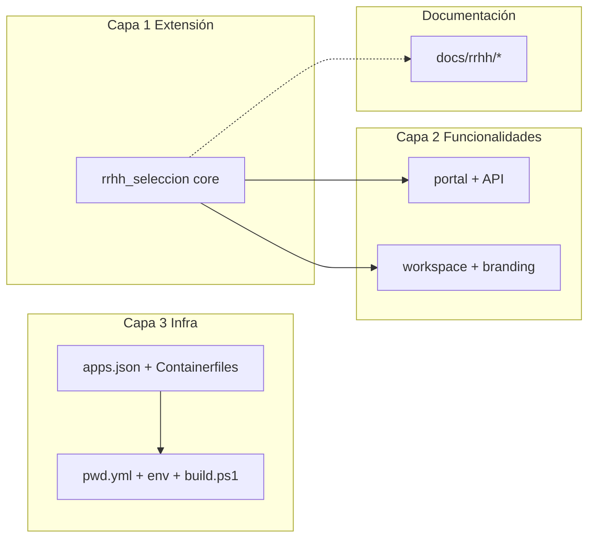

# Organización del trabajo: extensión vs funcionalidades nuevas

## Objetivo

Mantener **dos líneas de trabajo** claras:

1. **Proyecto de extensión** — producto estable `rrhh_seleccion` (contrato con HRMS, roles, modelo de datos núcleo).
2. **Funcionalidades nuevas** — entregas iterativas (portal, APIs, pantallas, reglas de negocio adicionales) que **no** deben ir mezcladas en el mismo PR que cambios de Docker o de la base de la extensión.

La **infraestructura Docker** es una **tercera línea**: solo despliegue y piloto, sin lógica de negocio.

---

## Capa 1 — Extensión (`rrhh_seleccion`)

**Repositorio ideal a medio plazo:** app en su propio Git (`rrhh_seleccion`), instalable con:

```bash
bench get-app https://github.com/nick130920/rrhh_seleccion
bench --site <sitio> install-app rrhh_seleccion
```

**Hoy en este monorepo:** código en `resources/rrhh_seleccion/`.

### Pertenece a la extensión (cambios “de producto base”)

- `hooks.py`, `setup/after_install.py` (roles, permisos, icono Desk)
- DocTypes núcleo: `Postulacion`, tablas hijas, enlaces a `Job Applicant`
- Eventos que **no** rompen HRMS estándar
- `modules.txt`, workspace mínimo operativo
- Tests de integración con HRMS (cuando existan)

### No mezclar aquí

- Ajustes de `pwd.yml`, `Containerfile`, `apps.json`
- Documentos de UAT del cliente (van en `docs/rrhh/producto/` u `operaciones/`)

---

## Capa 2 — Funcionalidades nuevas

Cada funcionalidad = **rama + PR pequeño** solo sobre `resources/rrhh_seleccion/` (y su doc en el backlog).

| ID | Funcionalidad | Estado sugerido | Rutas principales |
|----|---------------|-----------------|-------------------|
| F-01 | Portal `/seleccion` + consulta estado | Hecho (piloto) | `www/`, `api/consultar.py` |
| F-02 | Branding Desk (CSS, icono, workspace) | Hecho (piloto) | `public/`, `seleccion/workspace/` |
| F-03 | Evaluación ocupacional / inducciones / EPP | Hecho (modelo) | `seleccion/doctype/*` |
| F-04 | Workflows y permisos finos por rol | Pendiente cliente | Custom DocPerm, Workflow |
| F-05 | … | Añadir en [backlog-funcionalidades.md](producto/backlog-funcionalidades.md) | |

**Convención de ramas (Git):**

```text
app/rrhh-seleccion-core     # solo extensión base
feature/F-04-workflows      # una funcionalidad
infra/pwd-hrms-piloto       # solo Docker/compose (ver capa 3)
```

---

## Capa 3 — Infra piloto / producción (frappe_docker)

Fork o rama sobre `frappe/frappe_docker` con **solo**:

| Archivo / carpeta | Propósito |
|-------------------|-----------|
| `apps.json` | ERPNext + HRMS en la imagen |
| `images/layered/Containerfile`, `images/custom/Containerfile` | Copiar `rrhh_seleccion` al build |
| `pwd.yml`, `pwd-hrms.env`, `pwd-hrms.example.env` | Piloto local |
| `resources/build-pwd-with-hrms.ps1` | Build imagen `local/erpnext-hrms:16` |
| Cambios menores en `resources/core/*.sh` | Solo si el piloto lo exige |

**PR de infra** no debe incluir DocTypes ni hooks salvo que sea estrictamente necesario para copiar la app en la imagen.

---

## Cómo partir el trabajo actual (sin perder nada)

Si todo está en `main` sin commitear, orden sugerido de **PRs independientes**:



1. **PR Infra** — `apps.json`, `images/*`, `pwd.yml`, `pwd-hrms.*`, `build-pwd-with-hrms.ps1`, scripts `core` si aplica.  
2. **PR Extensión** — scaffold app, hooks, roles, DocTypes núcleo, eventos `Job Applicant`.  
3. **PR Funcionalidad** — una por épica (portal, branding, etc.).  
4. **PR Docs** — `docs/rrhh/` (puede ir con el PR que documenta).

---

## Repositorios (recomendación)

| Repo | Contenido |
|------|-----------|
| [`rrhh_seleccion`](https://github.com/nick130920/rrhh_seleccion) | Solo la app Frappe; releases versionados (`v0.1.0` piloto). |
| [`frappe_docker`](https://github.com/nick130920/frappe_docker) (fork) | Infra + submódulo `resources/rrhh_seleccion` en el build Docker. |
| Opcional: `rrhh-docs` | Solo si el cliente necesita docs fuera del código |

Hasta crear el repo de la app, **trabaja en ramas** dentro de este fork y evita `git add .` al commitear: stage solo la capa del PR.

---

## Cursor / día a día

- **Remote SSH** al PC Windows → abrir carpeta del **fork** `frappe_docker` para infra.  
- Para solo la app: abrir `resources/rrhh_seleccion` o el repo dedicado cuando exista.  
- Issues o tareas: etiquetar `extension`, `feature`, `infra` según la tabla de capas.

---

## Siguiente paso opcional

1. Inicializar repo Git en `resources/rrhh_seleccion` y publicarlo.  
2. En el fork, sustituir la carpeta por **submódulo** o `bench get-app` en el Containerfile.  
3. Abrir el primer PR solo **infra** y otro solo **extensión core**, usando el backlog para lo demás.
